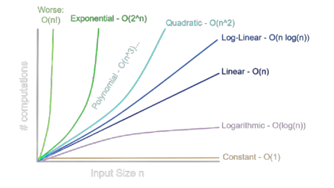

# Complexity
- [Introduction](#introduction)
- [Big O Notation](#big-o-notation)
- [Examples](#examples)
  - [Speed](#speed)
  - [Memory](#memory)
- [Sources](#sources)

## Introduction

Complexity describes how the resource usage of an algorithm (time or space) grows as the input size increases.
It allows comparing algorithms independently of hardware, by focusing on their growth rate.

## Big O Notation

Big O describes the **worst-case** upper bound of an algorithm's growth rate, ignoring constants and lower-order terms.

| Notation | Name | Example |
| :--- | :--- | :--- |
| $O(1)$ | Constant | Accessing an array element by index |
| $O(\log n)$ | Logarithmic | Binary search |
| $O(n)$ | Linear | Iterating through an array |
| $O(n \log n)$ | Linearithmic | Merge sort |
| $O(n^2)$ | Quadratic | Nested loops (bubble sort) |
| $O(n^3)$ | Cubic | Triple nested loops |
| $O(2^n)$ | Exponential | Recursive Fibonacci |
| $O(n!)$ | Factorial | Generating all permutations |

> [!NOTE]
> Top to bottom is from best to worst.



---

## Examples

> [!NOTE]
> Examples are in python and not full functional code, just an example of how the complexity works.

### Speed

$O(1)$ - Constant:
```shell
def get_first(items):
    return items[0]
```

$O(\log n)$ - Logarithmic:
```shell
def binary_search(arr, target):
    l, r = 0, len(arr) - 1
    while l <= r:
        m = (l + r) // 2
        if arr[m] == target: return m
        if arr[m] < target: l = m + 1
        else: r = m - 1
    return -1
```

$O(n)$ - Linear:
```shell
def find_item(items, target):
    for item in items:
        if item == target:
            return True
    return False
```

$O(n \log n)$ - Linearithmic:
```shell
def sort_items(items):
    return sorted(items) # Python's Timsort
```

$O(n^2)$ - Quadratic:
```shell
def has_duplicate(items):
    for i in range(len(items)):
        for j in range(i + 1, len(items)):
            if items[i] == items[j]:
                return True
    return False
```

$O(n^3)$ - Cubic:
```shell
def triple_loop(n):
    for i in range(n):
        for j in range(n):
            for k in range(n):
                print(i, j, k)
```

$O(2^n)$ - Exponential:
```shell
def fibonacci(n):
    if n <= 1:
        return n
    return fibonacci(n - 1) + fibonacci(n - 2)
```

$O(n!)$ - Factorial:
```shell
def permutations(items):
    if len(items) == 0: return [[]]
    res = []
    for i in range(len(items)):
        m = items[i]
        rem = items[:i] + items[i+1:]
        for p in permutations(rem):
            res.append([m] + p)
    return res
```

### Memory

$O(1)$ - Constant:
```shell
def sum_values(items):
    total = 0
    for item in items:
        total += item
    return total
```

$O(\log n)$ - Logarithmic (Recursion Stack):
```shell
def recursive_binary_search(arr, l, r, x):
    if r >= l:
        mid = l + (r - l) // 2
        if arr[mid] == x:
            return mid
        if arr[mid] > x:
            return recursive_binary_search(arr, l, mid - 1, x)
        return recursive_binary_search(arr, mid + 1, r, x)
    return -1
```

$O(n)$ - Linear:
```shell
def double_values(items):
    return [item * 2 for item in items]
```

$O(n \log n)$ - Linearithmic (Merge Sort Space):
```shell
# Sorting typically creates temp arrays and recursion stack
def merge_sort(arr):
    if len(arr) > 1:
        mid = len(arr)//2
        L = arr[:mid] # Extra space
        R = arr[mid:] # Extra space
        merge_sort(L)
        merge_sort(R)
```

$O(n^2)$ - Quadratic:
```shell
def create_matrix(n):
    return [[0] * n for _ in range(n)]
```

$O(n^3)$ - Cubic:
```shell
def create_3d_grid(n):
    return [[[0] * n for _ in range(n)] for _ in range(n)]
```

$O(2^n)$ - Exponential:
```shell
def power_set(s):
    res = [[]]
    for x in s:
        res.extend([subset + [x] for subset in res])
    return res
```

$O(n!)$ - Factorial:
```shell
import itertools
def get_all_permutations(items):
    return list(itertools.permutations(items))
```

---

## Sources

- [Wikipedia](https://en.wikipedia.org/wiki/Big_O_notation)
- [Big O Cheat Sheet](https://www.bigocheatsheet.com/)
- [Computerphile](https://www.youtube.com/watch?v=kgBjXUE_Nwc)
- [GeeksforGeeks](https://www.geeksforgeeks.org/dsa/analysis-algorithms-big-o-analysis/)
- [Greg Hogg Youtube](https://www.youtube.com/watch?v=aWKEBEg55ps)