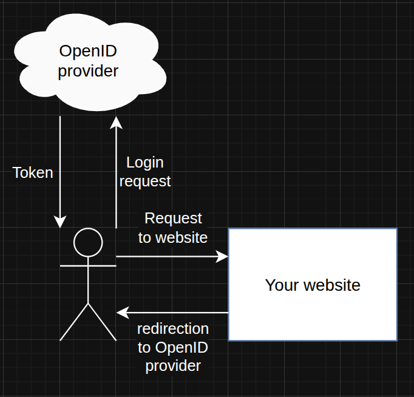
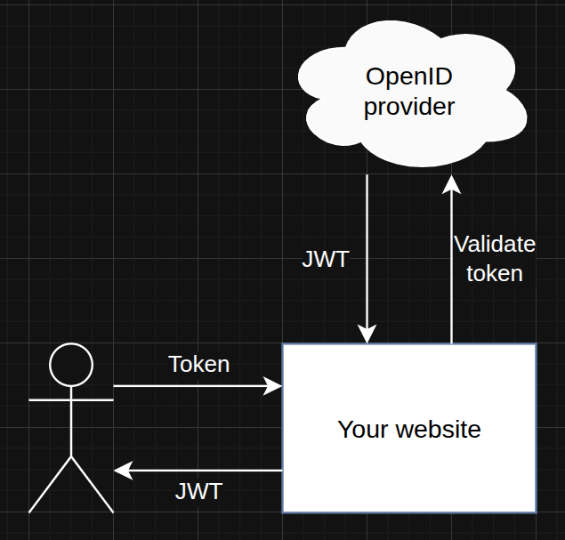

# OpenID Connect (OIDC)

OpenID Connect (OIDC) is an authentication layer built on top of OAuth 2.0. It lets users sign in to websites or apps using an identity provider (IdP) such as Google, Microsoft, Meta and more. This provides a single trusted login (SSO) and reduces the need for separate passwords for every site.

## How OIDC works

1. Authorize (user login)
- The user clicks a provider sign-in button on your site.
- Your site redirects the user's browser to the provider's `/authorize` endpoint with parameters like `client_id` to validate on behalf which website you were redirected to login and `redirect_uri` to know to where redirect you back after your login.
- The provider authenticates the user and redirects back to your `redirect_uri` with an authorization code (in the Authorization Code flow) or an ID token (in implicit flows).



2. Tokenize (server exchanges code for tokens)
- Your backend exchanges the ID token with the provider's `/token` endpoint (server-to-server).
- The provider returns tokens: an ID token (a JWT containing user identity claims), an access token, and refresh token.



Example ID token payload (decoded JWT):
```shell
{
  "iss": "https://server.example.com",
  "sub": "248289761001",
  "aud": "s6BhdRkqt3",
  "nonce": "n-0S6_WzA2Mj",
  "exp": 1311281970,
  "iat": 1311280970,
  "name": "Jane Doe",
  "given_name": "Jane",
  "family_name": "Doe",
  "email": "janedoe@example.com"
}
```

## Session management (cookies vs storing tokens)

- Option A — Store the ID token (JWT) in a secure, HTTP-only cookie:
  - Pros: simpler to implement; backend can read token to get user info.
  - Cons: cookie carries user claims; revocation is harder; token size can be large.

- Option B — Store a server-side session identifier (hash) in the cookie and keep tokens server-side:
  - Pros: cookies contain no user info; you control session lifetime and revocation.
  - Cons: requires server-side storage (cache or DB) and lookup logic.

You can also accept `Authorization` headers bearing access tokens for API requests.

## Validation

- Check the ID token's `exp` claim to ensure it hasn't expired.
- Verify the ID token signature and claims (`iss`, `aud`, `nonce`) using the provider's JWKS (public keys).
- Optionally call the provider's `/userinfo` endpoint with the access token to fetch and validate the user's profile.

## Refresh tokens

- If the provider issues a `refresh_token`, your backend can call `/token` with it to obtain new access/ID tokens without user interaction.
- Keep refresh tokens secure and rotate or revoke them when needed.

## Logout

- Clear local session state (cookie or server-side session).
- Optionally call the provider's end-session or `/logout` endpoint to log out at the IdP; support varies between providers.

## Sources
- https://openid.net/