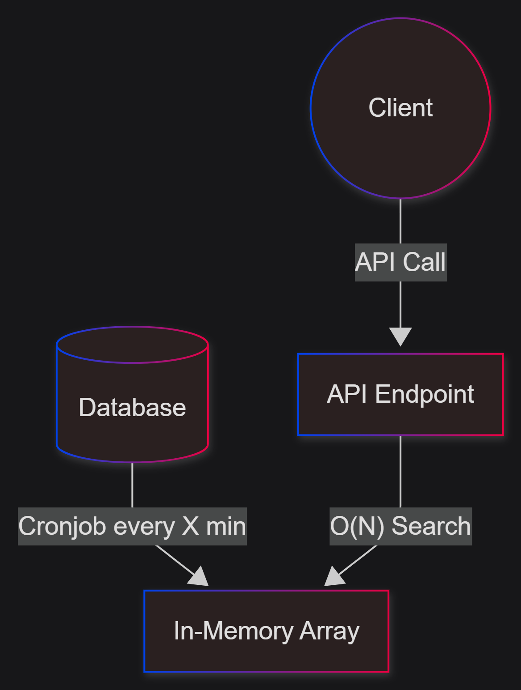

# Performance Optimization Without Metrics
- [The Scenario](#the-scenario)
- [The AI-Suggested Optimization](#the-ai-suggested-optimization)
- [Was It Actually Efficient?](#was-it-actually-efficient)
- [The Solution: Metrics First](#the-solution-metrics-first)
- [Sources](#sources)

## The Scenario

We had a system with the following setup:
1. A background scheduled job runs every $X$ minutes, fetches unsorted products data for multiple customers from the database, and stores it in an in-memory array.
2. An API endpoint allows customers to query their products.
3. Every time the API is called, it performs an $O(N)$ linear search on the array to filter and return the customer's items.

## The AI-Suggested Optimization

To improve runtime complexity, an AI coding assistant suggested two changes:
1. **Push Sorting to the DB:** Add an `ORDER BY` clause to the SQL query executed by the scheduled job.
2. **Use a Hash Map:** Convert the in-memory array to a Hash Map (`Dictionary<CustomerId, List<Product>>`) during the scheduled job execution.

Building the Hash Map is a single $O(N)$ pass during the cron run.
In return, each subsequent API call gets its data in $O(1)$ constant time.

## Was It Actually Efficient?

On paper, replacing $O(N)$ queries with $O(1)$ lookups is a classic optimization. However, because we lacked observability metrics, we didn't know how often the API was actually being called.

Let's analyze the efficiency based on the number of API calls ($M$) received between cron runs:

| Scenario | Old Cost | New Cost | Verdict |
| :--- | :--- | :--- | :--- |
| **$M \gg 1$ (Frequent Calls)** | $O(M \times N)$ | $O(N + M)$ | **Huge Win:** The upfront cost of building the map is amortized over many fast $O(1)$ lookups. |
| **$M = 1$ (Exactly One Call)** | $O(N)$ | $O(N + 1)$ | **Wash:** The performance is virtually identical, but we introduced $O(N)$ extra memory overhead for the map. |
| **$M < 1$ (Rare/No Calls)** | $O(0)$ | $O(N)$ | **Net Loss:** We wasted CPU and memory building a Hash Map that was never queried. |

> [!WARNING]
> Without knowing $M$ (API call frequency relative to cron frequency), we cannot know if this optimization improved customer experience or just wasted memory.

## The Solution: Metrics First

Before optimizing code, you must measure its usage.
The real first step should have been adding one of this options telemetry:
1. **Specific Endpoint Metric:** Track call volume.
2. **Observability Middleware:** Implement middleware to capture request rates and latency dimensions.

With AI tools, making code changes is easier than ever.
However, we must consider the Return on Investment (ROI): even if an AI generates a fix in seconds, an engineer still spends valuable work hours reviewing the code, verifying its correctness, and deploying it.
Combined with AI token costs, optimizing code without actual usage metrics is a shot in the dark. Measure first, optimize second.

## Sources

- [Premature Optimization (Wikipedia)](https://en.wikipedia.org/wiki/Program_optimization#When_to_optimize)
- [Observability Engineering (O'Reilly)](https://www.oreilly.com/library/view/observability-engineering/9781492090755/)
- [Complexity](https://barakadax.github.io/blog?article=Complexity)
