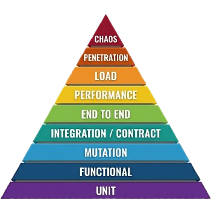

# Testing pyramid
- [What is the testing pyramid?](#what-is-the-testing-pyramid)
- [Why do we need testing?](#why-do-we-need-testing)
- [What is mocking?](#what-is-mocking)
- [Types of tests](#types-of-tests)
  - [Unit testing](#unit-testing)
  - [Functional testing](#functional-testing)
  - [Smoke testing](#smoke-testing)
  - [Sanity testing](#sanity-testing)
  - [Mutation testing](#mutation-testing)
  - [Integration testing](#integration-testing)
  - [Contract testing](#contract-testing)
  - [Migration testing](#migration-testing)
  - [End to End testing](#end-to-end-testing)
  - [Performance testing](#performance-testing)
  - [Load testing](#load-testing)
  - [Penetration testing](#penetration-testing)
  - [Chaos testing](#chaos-testing)
- [Recommended programs and tools](#recommended-programs-and-tools)
- [Sources](#sources)

## What is the testing pyramid?

The Testing Pyramid is a conceptual framework that helps structure a software testing strategy.
It shows which types of tests we need more of (the wide base) and which we should have fewer of (the narrow tip).
The goal is to build a well-balanced test portfolio that runs fast while maintaining high confidence.

## Why do we need testing?

Testing guarantees that the code functions as expected.
The more comprehensive your test suite, the better your odds of catching issues before they reach production.
Furthermore, if bugs do reach production, having tests helps identify and replicate them quickly.
A solid testing strategy benefits the entire lifecycle, providing stability and confidence for developers, QA, DevOps, and security teams alike.

## What is mocking?

Mocking is a technique used in testing where real external dependencies (like databases or third-party APIs) are replaced by fake, simulated versions.
This ensures tests run fast and strictly validate your own code's logic without relying on outside systems.

## Types of tests

Going from the bottom of the pyramid to the top:

### Unit testing
The foundation of the pyramid.
Validates specific components or functions in pure isolation by mocking all external dependencies (APIs, libraries, etc.).
These are the fastest to execute, and you are expected to have the most of them.

- **Measurement:** **Line and Branch Coverage** — tracks which parts of the code were executed.
- **Quality Indicator:** High coverage (typically 95%) without sacrificing test readability or meaningful assertions.

### Functional testing
Similar to unit testing, validates entire application flows while mocking all external dependencies, focusing purely on verifying functional business logic.

- **Measurement:** **Requirement Coverage** — ensures every business rule is mapped to a test case.
- **Quality Indicator:** All "happy paths" and common edge cases are validated against the specification.

### Smoke testing
In comparison to unit and functional tests, smoke tests are feature-based.
They consist of a smaller suite of tests that guarantees core feature functionality.
Smoke tests often use stubbed external dependencies that simulate the real world rather than mocking in total isolation.
They are typically run by developers during local development and in CI/CD pipelines after deployment to validate that the build is stable.

- **Measurement:** **Feature Coverage** — ensures every feature is working as expected.
- **Quality Indicator:** All "happy paths" and common edge cases are validated against the specification.

### Sanity testing
Cherry-picking a subset of critical unit, functional, and smoke tests, bundled into a sanity suite that runs faster than running all of the unit, functional and smoke tests.
It is typically used to verify that specific bug fixes or changes work as intended.

- **Measurement:** **Feature Coverage** — ensures every feature is working as expected.
- **Quality Indicator:** All "happy paths" and common edge cases are validated against the specification.

### Mutation testing
Automatically introduces small algorithmic modifications ("mutations") into your code to see if your existing tests fail.
It evaluates the quality and effectiveness of your test suite — if a mutation survives (tests still pass), you have a gap in coverage.

- **Measurement:** **Mutation Strength** — the percentage of "mutants" killed by your tests.
- **Quality Indicator:** A high score (95%) indicates that your tests are actually asserting behavior, not just executing lines.

### Integration testing
Tests how multiple separated components or microservices interact.
Ensures that points of contact are resilient, verifying that your component can successfully communicate with its required dependencies.

- **Measurement:** **Interface/API Coverage** — tracks which service-to-service interaction points are tested.
- **Quality Indicator:** Successful data exchange across component boundaries without regression.

### Contract testing
Similar to integration testing but focuses strictly on the boundaries ("contacts") between services.
It validates that your APIs and the external APIs you interact with continue to comply strictly with agreed-upon schemas, mocking the rest.

- **Measurement:** **Schema Compliance Rate**.
- **Quality Indicator:** 100% agreement between Consumer and Provider contracts, preventing breaking changes.

### Migration testing
Validates that database schema changes or data migration processes (porting data/configurations from old to new structures or systems) execute successfully.
It ensures data integrity is preserved, database constraints are not violated, no data is lost or corrupted.

- **Measurement:** **Migration Success Rate**, **Data Drift/Loss Rate** (verifying source and target parity), and **Rollback Success Rate**.
- **Quality Indicator:** Zero database integrity or constraint violations, zero lost/corrupted records, and validated rollback scripts.

### End to End testing
Validates the entire expected flow from a user's perspective (happy path), from start to finish without mocked dependencies.
Since these tests are slow and prone to flakiness, you should have the fewest of them, running them typically on a schedule basis.

- **Measurement:** **User Journey Coverage**.
- **Quality Indicator:** High reliability (low flakiness) and 100% pass rate on critical user flows.

### Performance testing
Evaluates the runtime behavior and memory usage of the application.
It is best used for pinpointing bottlenecks.

- **Measurement:** **Latency (p95/p99)**, **Throughput (RPS)**, and **Resource Consumption (CPU/RAM)**.
- **Quality Indicator:** Performance remains within defined SLAs (Service Level Agreements) under normal conditions.

### Load testing
Spams API endpoints with heavy traffic to validate how many simultaneous calls the application can handle, revealing thresholds where responses corrupt or the code crashes.
It is also highly beneficial for triggering concurrency bugs such as deadlocks.

- **Measurement:** **Error Rate** and **Saturation Point** (where response time spikes).
- **Quality Indicator:** The system handles expected peak traffic without crashing or significant degradation.

### Penetration testing
Targets the security aspect, hunting for exploits and potential vulnerabilities.
Executing these tests periodically is a best practice to guarantee security.

- **Measurement:** **Vulnerability Count and Severity** (CVSS scores).
- **Quality Indicator:** Zero unresolved "Critical" or "High" severity vulnerabilities.

### Chaos testing
The practice of intentionally killing services and dependencies during runtime, usually in production SaaS environment, to validate system resilience and self-healing abilities.

- **Measurement:** **Availability %** and **Recovery Time Objective (RTO)**.
- **Quality Indicator:** The system stays online or self-heals automatically without manual intervention when a dependency fails.

> [!NOTE]
> Unit, functional, smoke and mutation testing should indicate regression in development.
> Sanity testing should indicate regression in CICD before deployment.
> Integration, contract, migration and E2E testing should indicate regression in runtime or deployment phases.
> Load and performance testing should indicate degradation in runtime after deployment.

## Recommended programs and tools

- **Coverage:** Tools like [JaCoCo](https://www.jacoco.org/jacoco/) (Java), [coverage.py](https://coverage.readthedocs.io/) (Python) and [pytest-cov](https://pytest-cov.readthedocs.io/en/latest/) (Python) provide detailed line and branch coverage reports.
- **Mutation:** Each programming language has its unique tooling. For example, Python uses [`mutmut`](https://github.com/boxed/mutmut) and Java uses [Pitest](https://pitest.org/).
- **Contract:** [Pact](https://docs.pact.io/) is an industry standard that supports multiple languages for robust contract testing.
- **Migration:** [Liquibase](https://www.liquibase.org/) and [Flyway](https://flywaydb.org/) help version and manage database schema migrations, whereas tools like [Great Expectations](https://greatexpectations.io/) or integration test suites utilizing [Testcontainers](https://testcontainers.com/) validate data integrity before and after migration.
- **Performance:** **Flame graphs** intuitively visualize code execution duration. Rust, for example, has [`flamegraph-rs`](https://github.com/flamegraph-rs/flamegraph).
- **Load:** [Locust](https://locust.io/) is a Python tool that allows local and distributed API spamming (REST, gRPC, GraphQL) across multiple nodes. [k6](https://k6.io/) is another widely praised modern alternative.
- **Chaos:** [Chaos Monkey](https://netflix.github.io/chaosmonkey/), developed by Netflix, performs random instance termination—doing exactly what it promises even on live production environments.

## Sources

- [Software testing](https://en.wikipedia.org/wiki/Software_testing)
- [Test automation](https://en.wikipedia.org/wiki/Test_automation)
- [Testing pyramid](https://www.geeksforgeeks.org/software-engineering/what-is-the-agile-testing-pyramid/)
- [JaCoCo](https://www.jacoco.org/jacoco/)
- [coverage.py](https://coverage.readthedocs.io/)
- [pytest-cov](https://pytest-cov.readthedocs.io/en/latest/)
- [Pitest](https://pitest.org/)
- [Mutmut](https://github.com/boxed/mutmut)
- [Flame graph](https://en.wikipedia.org/wiki/Flame_graph)
- [rs-flame graph](https://github.com/flamegraph-rs/flamegraph)
- [Pact](https://docs.pact.io/)
- [Locust](https://locust.io/)
- [Chaos monkey](https://netflix.github.io/chaosmonkey/)
- [Smoke test](https://en.wikipedia.org/wiki/Smoke_testing_(software))
- [Sanity test](https://en.wikipedia.org/wiki/Sanity_check)
- [Migration testing (Wikipedia)](https://en.wikipedia.org/wiki/Migration_testing)
- [Liquibase](https://www.liquibase.org/)
- [Flyway](https://flywaydb.org/)
